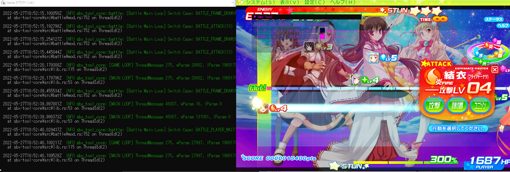
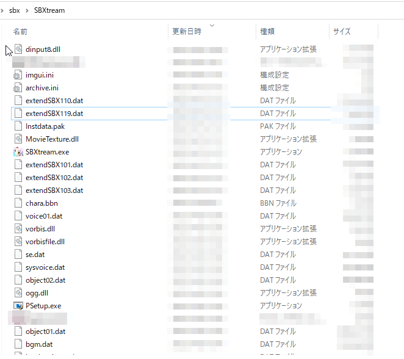
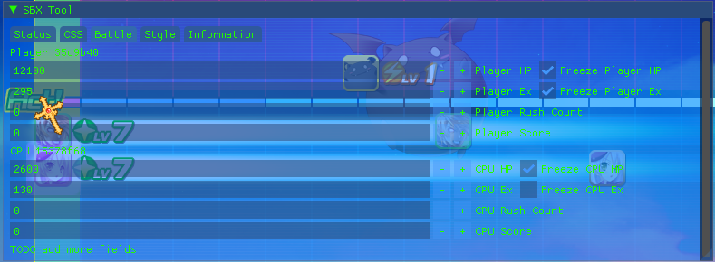

# sbx-tool

Dll hack for Twinkle ☆ Crusaders -Starlit Brave Xtream!!-  (version [1.19](https://lillian.jp/support/support.html))  
[vndb](https://vndb.org/v5937)  
[official](https://lillian.jp/kurukuru2/sbx.html)

Still work in progress.
Written in [Rust](https://www.rust-lang.org/) language.

# Special Thanks  
Thank you for the high quality libraries.  
[imgui](https://github.com/ocornut/imgui) by [ocornut](https://github.com/ocornut) and its [Rust binding](https://github.com/imgui-rs/imgui-rs)  
[ilhook-rs](https://github.com/regomne/ilhook-rs) by [regomne](https://github.com/regomne)  
[imgui-impl-win32-rs](https://github.com/super-continent/imgui-impl-win32-rs) by [super-continent](https://github.com/super-continent)  
[detour](https://github.com/darfink/detour-rs) and [retour](https://github.com/Hpmason/retour-rs)

# Download
[Debug dll](https://github.com/nisetynet/twinkle-crusaders-sbx-tool/raw/master/dlls/sbx_tool_dll_debug.dll)  
[Release dll](https://github.com/nisetynet/twinkle-crusaders-sbx-tool/raw/master/dlls/sbx_tool_dll_release.dll)  
  
Debug dll comes with a debug console.  
Release dll comes with no debug console and better runtime performance and small binary size.
### Debug Console
  


# 使い方
5chを見たら使い方の説明を求めている方がいたので起動方法を簡易化しました。  

ご自分でインジェクトできる方はインジェクトしても大丈夫です。(この方法でやるとデバッグコンソールが付いてきてしまうので鬱陶しいかもしれません。)  

[dinput8.dll](https://github.com/nisetynet/twinkle-crusaders-sbx-tool/raw/master/experimental/dinput8.dll) ←をダウンロードします。  

ファイル名を変更すると動作しなくなりますので、そのままSBXがインストールされているフォルダに配置してください。  

  

後は普段通りにSBXを起動すれば勝手に読み込まれます。  

releaseビルドだけで何故かクラッシュするので原因を特定するまではデバッグコンソールを消すことができません。
邪魔であれば最小化してください。  

(debug-assertions をfalseにするとクラッシュすることは分かった。　多分AllocConsoleを呼ばないと落ちるのだがdinput8フック関連のコードでは標準出力を使用していないので原因が分からない。)


# How To Build(WIP)
## [Step 1] Install rust tool chains.
https://rustup.rs/

## [Step 2] Install x86 msvc Rust.
```
rustup target add i686-pc-windows-msvc
```

Install rust nightly
```
rustup default nightly
```

You can revert by doing
```
rustup default stable
```

## [Step 3] Build
Debug build.
```
cargo build
```

Release build.
```
cargo build --profile release
```
  
  
  
# Change Log
#### 2024/01/07
nightly rustの変更でdetourライブラリが使えなくなっているので修正されたフォークへ変更。  
その他ビルドエラーを解決。

#### 2022/8/4
dinput8 hookを利用して導入を簡略化した。

#### 2022/8/1
Rust's main branch renamed and relocated std::lazy stuffs.
std::lazy::SyncOnceCell is now std::sync::OnceLock thus I had to change the codes to adapt it.

details: https://github.com/rust-lang/rust/commit/c1a2db3372a4d6896744919284f3287650a38ab7

Wrote build instructions.

#### 2022/6/28
Smooth graphic upon ex changes with the tool.

#### 2022/6/27
Smooth graphic upon hp changes with the tool.  

#### 2022/6/26
Partially disabled max ex cap.(Unstable. Cause crash sometimes. Probably when ex exceeds 2xxx ~ ?)  

#### 2022/6/25
Partially disabled max hp cap.(Unstable. Cause crash sometimes.)  

#### 2022/6/25
Refactored little.  

#### 2022/6/25
Refactored little.  

#### 2022/6/16
Using a better way to get address of directx functions now.  

#### 2022/05/29
Implemented ui loop switch case log.  (Sounds waste of time, but it eases further reversing!!)  

#### 2022/05/28
  
Implemented freeze check box for battle hp and ex.  


# TODOs  
- [ ] disable max hp cap.(Partially done.)
- [x] ~~I found that hp fix is not working when imgui window is collapsed. Better spawn thread for hacks and use channel.~~
- [ ] Implement save & load imgui style(Need to hold imgui context with Arc<RwLock<>> since it is also used by endscene function) lazy af
- [x] ~~Freeze check box for player cpu hp, ex and etc(only player hp is done)~~
- [ ] Reverse thread messages(main loop hook is already done, need to figure out about message it self)
- [ ] Reverse bgm and se thread messages(inline hook PeekMessage and PostMessage)
- [ ] Inline hook battle loop switch and identify cases(Hook is done)
- [ ] Reverse more with identified battle loop switch cases
- [ ] Figure out about 'character context'(where the client holds character informations such as a frame position.)

